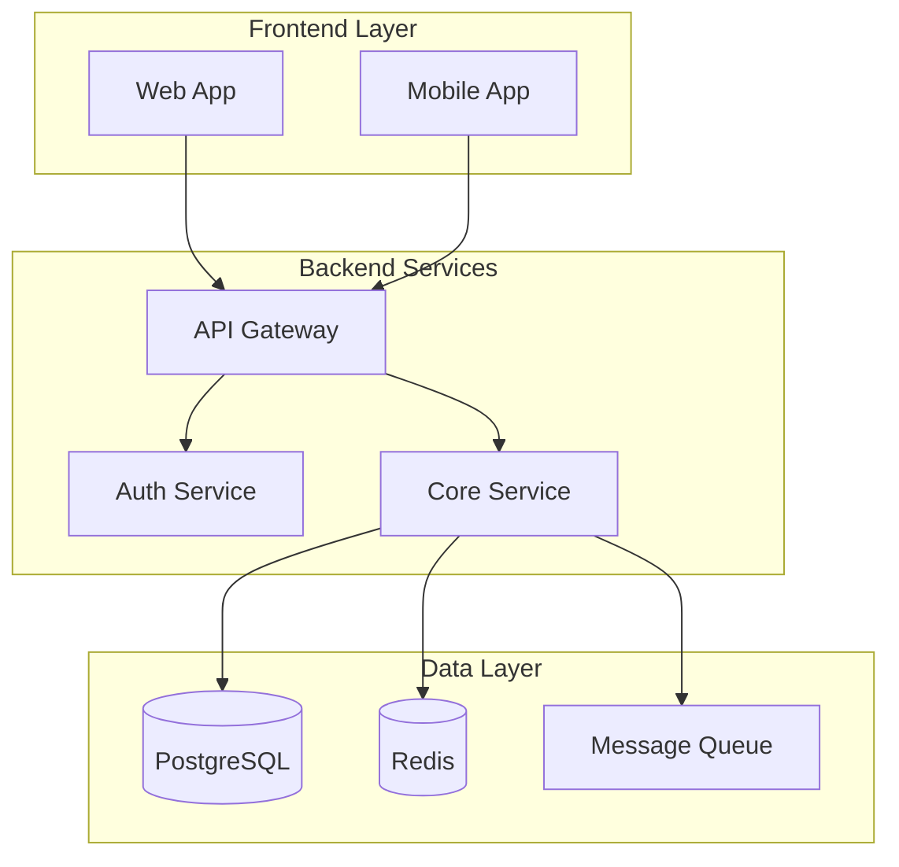
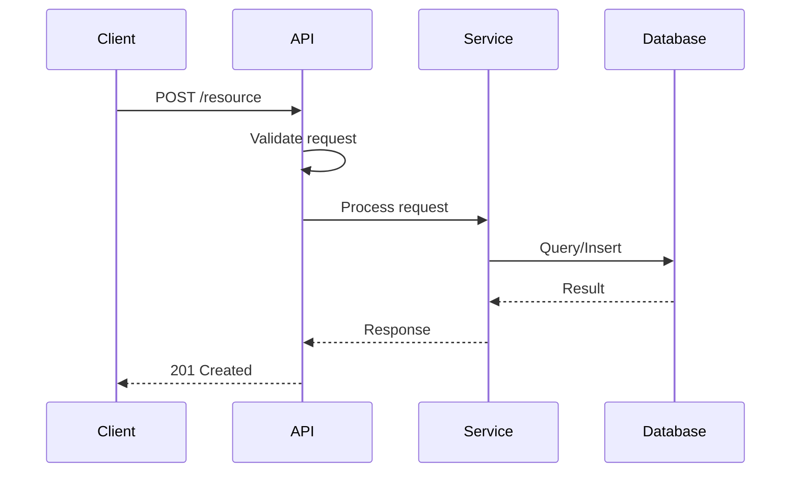
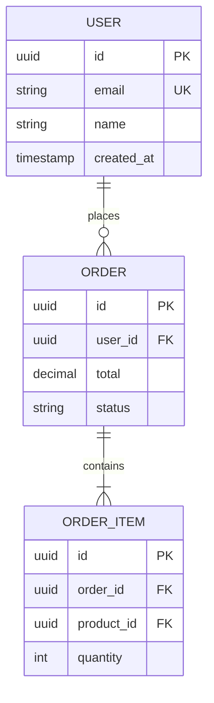
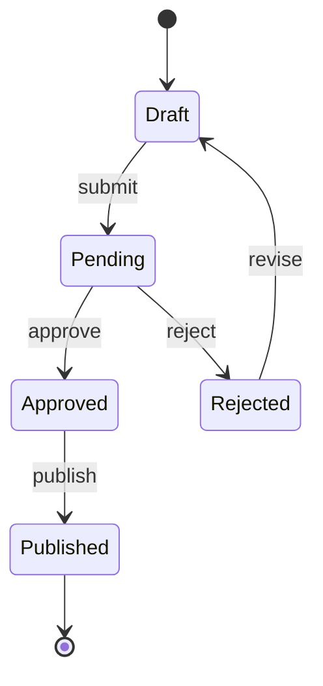

# Documentation Skill

Knowledge and patterns for creating comprehensive technical documentation.

## When to Use

- Generating README files
- Creating API documentation
- Documenting architecture and system design
- Building database schema documentation
- Writing developer guides and onboarding docs

## Mermaid Diagram Patterns

### Architecture Diagrams



### Sequence Diagrams (API Flows)



### Entity Relationship Diagrams



### State Diagrams



## Documentation Templates

### API Endpoint Template

```markdown
## Endpoint Name

`METHOD /path/to/endpoint`

Description of what this endpoint does.

### Request

**Headers:**
| Header | Required | Description |
|--------|----------|-------------|
| Authorization | Yes | Bearer token |

**Body:**
```json
{
  "field": "value"
}
```

### Response

**Success (200):**
```json
{
  "data": {}
}
```

**Errors:**
| Code | Description |
|------|-------------|
| 400 | Invalid request |
| 401 | Unauthorized |
```

### README Template

```markdown
# Project Name

Brief description of the project.

## Architecture

[Mermaid diagram here]

## Getting Started

### Prerequisites
- Requirement 1
- Requirement 2

### Installation
```bash
# Installation commands
```

### Configuration

| Variable | Required | Default | Description |
|----------|----------|---------|-------------|
| DATABASE_URL | Yes | - | PostgreSQL connection string |

## API Reference

See [API Documentation](./docs/api.md)

## Development

### Running Tests
```bash
# Test commands
```

### Code Style
Description of code style and linting.

## Deployment

Deployment instructions and requirements.
```

## Best Practices

1. **Start with diagrams** - Visualize before writing prose
2. **Use consistent terminology** - Define terms in a glossary if needed
3. **Include examples** - Real code examples for every concept
4. **Keep it updated** - Documentation rots quickly
5. **Link related docs** - Cross-reference for discoverability
6. **Version your docs** - Match documentation to code versions
